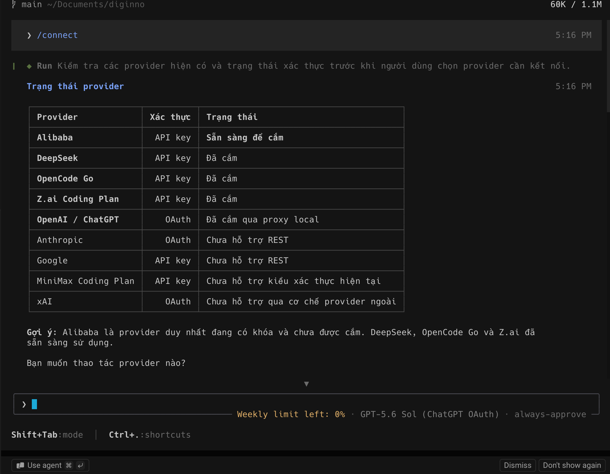
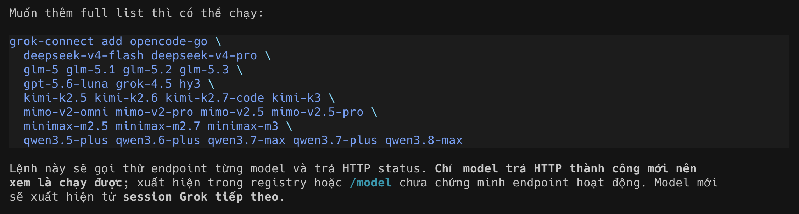

# grok-connect

把第三方模型供应商挂到 **Grok Build**（xAI 的 `grok` CLI）上——GLM/智谱、DeepSeek、opencode Zen、
阿里云，以及任何 OpenAI 兼容端点——不用手改 TOML，也不用把任何一个 API key 抄进配置文件。

[English](README.md) · [Tiếng Việt](README.vi.md) · **中文**

```
$ grok-connect list
provider             key     protocol          status      base_url
deepseek             api     chat_completions  attached    https://api.deepseek.com
opencode-go          api     chat_completions  attached    https://opencode.ai/zen/go/v1
zai-coding-plan      api     chat_completions  ready       https://api.z.ai/api/coding/paas/v4

$ grok-connect add zai-coding-plan glm-5.2 glm-4.7
attached 'zai-coding-plan' to /Users/me/.grok/config.toml
Calling the endpoint:
  ok   glm-5_2                  HTTP 200  works
  ok   glm-4_7                  HTTP 200  works

All working. Use: grok -m <model>  ·  or /model inside the TUI
```

---

## 在 TUI 里直接用 `/connect`



输入 `/connect`，agent 会替你跑 `grok-connect list`，把表格念给你听，然后问要挂哪个供应商——
它不会替你做决定。*（skill 提供英文、越南文、中文三版；截图是越南文版。）*



注意最后那句：**只有 HTTP 返回成功才算证据。** 出现在 registry 里或 `/model` 列表里，都不代表
端点真的会响应。新模型从下一个 grok 会话开始出现。

---

## 为什么需要它

Grok Build 本来就是个多供应商客户端——它的 sampler 会说三种协议（`chat_completions`、
`responses`、Anthropic `messages`），`[model.*]` 配置块可以指向任意端点。它**缺的**是用上这
一点的入口：

- `grok login` 只负责 **xAI** 登录（OAuth · device code · OIDC · 外部认证程序）。
- 没有 `/connect`，没有供应商选择界面，也没有"粘贴 API key"的地方。
- 加一个供应商 = 手写三段 TOML，每个字段都不能错。

`grok-connect` 就是补上这个入口。它从 [models.dev](https://models.dev) 读取 base URL 和模型目录，
取到密钥，写好配置，**然后真实调用一次端点，证明它确实能用**。

## 包含什么

| 组件 | 作用 |
|---|---|
| `grok-connect` | CLI：`list` · `models` · `add` · `test` · `remove`。负责写入/移除配置块。 |
| `grok-cred` | 接进 grok `[auth_provider.*]` 的凭据助手。调用时才取密钥，所以**不会有任何 secret 写进 `config.toml`**。 |
| `/connect` skill | 上面那个 CLI，在 grok TUI 里以斜杠命令出现。提供英文、越南文、中文三版。 |
| `chatgpt-responses-shim` | *可选，默认不安装。* 把 grok 接到 ChatGPT 订阅上。**动手之前先读下面的警告。** |

## 前置条件

- [Grok Build](https://x.ai/cli) ≥ 1.0.5（`grok --version`）
- Python 3.9+
- 密钥来自**以下任一**：
  - [opencode](https://opencode.ai) 的凭据库（`~/.local/share/opencode/auth.json`）——自动识别，无需配置
  - 环境变量——models.dev 声明的名字（`DEEPSEEK_API_KEY`、`ZHIPU_API_KEY`、`OPENCODE_API_KEY`…）或 `GROK_CRED_<PROVIDER>`

## 安装

```sh
git clone <本仓库> && cd grok-connect
./install.sh                 # 脚本装到 ~/.local/bin，/connect skill 装进所有 ~/.grok*
SKILL_LANG=zh ./install.sh   # 中文版 skill（还有：vi）
```

`install.sh` 会找出机器上所有 grok home（`~/.grok`、`~/.grok-100`…）并逐个安装 skill。
只想装到某一个 profile 就设 `GROK_HOME`。

## 使用

```sh
grok-connect list                              # 谁有密钥、哪些已挂载
grok-connect models zai-coding-plan            # 该供应商的模型目录
grok-connect add zai-coding-plan glm-5.2       # 挂载（不写模型 = 取前三个）
grok-connect test zai-coding-plan              # 随时复查
grok-connect remove zai-coding-plan            # 卸载
```

或者在 grok 里输入 `/connect`，让 agent 来跑。

新模型要**下一个**会话才出现——然后用 `/model <名字>` 或 `grok -m <名字>`。

## 它写了什么

每个供应商三段配置。注意：任何地方都没有密钥。

```toml
[auth_provider.zai-coding-plan]
command = "grok-cred zai-coding-plan"

[model_providers.zai-coding-plan]
base_url = "https://api.z.ai/api/coding/paas/v4"
api_backend = "chat_completions"
auth_provider = "zai-coding-plan"

[model.glm-5_2]
model = "glm-5.2"
model_provider = "zai-coding-plan"
name = "glm-5.2 (zai-coding-plan)"
context_window = 1000000
```

Grok 在每个需要 token 的回合前运行 `grok-cred`，把结果缓存在内存里，过期或被拒时再跑一次。
Token 不落盘。挂了 auth provider 的模型是**严格 BYOK：你的 xAI 会话 token 绝不会被发往第三方
端点。**

## 怎么验证——以及为什么 `grok models` 不算证据

`grok models` 只读配置文件。`base_url` 写错的模型照样出现在列表里，直到聊天时才报 404。
`add` 和 `test` 会为每个模型发一次真实 HTTP 请求：

| HTTP | 含义 |
|---|---|
| 200 | 可用 |
| 401 / 403 | 密钥错误或过期 · 密钥无权访问该模型 |
| **402** | 余额不足——**配置是对的**，充值即可 |
| **404** | **`base_url` 写错，或模型名写错** |
| **429** | 配额用尽 / 限流——**配置是对的**，等重置 |

这个区分很关键：402 和 429 是账户问题，404 才是你写错了。

## 值得知道的坑

- **不要无脑拼 `/v1`。** models.dev 记录的已经是完整 base。智谱是 `…/api/coding/paas/v4`，
  再加 `/v1` 直接 404。只有裸主机名（`https://api.deepseek.com`）才需要补。本工具处理对了——
  但你手改配置时就会踩这个坑。
- **Grok 会重写 `config.toml`。** 在 TUI 里切换模型会让 grok 规范化整个文件并**删掉所有注释**。
  还见过它把 `[models] default` 改成最后用过的模型。玩过模型选择器之后回头看一眼那一行。
- **探测请求不带真实 `User-Agent` 会拿到 403。** `opencode.ai` 前面的 WAF 会拒绝
  `Python-urllib`，读出来像是"密钥无权限"，其实密钥好好的。`grok-connect` 会带 UA——自己写检查
  脚本时记住这点。
- **走 Anthropic 协议的供应商暂不支持。** MiniMax 的 coding plan 之类用 `x-api-key` 认证，
  而 `grok-cred` 只签发 `Authorization: Bearer`。
- **有自家 SDK 的供应商挂不上**（Google、Anthropic 直连、xAI）：models.dev 没有为它们记录 REST
  base URL，grok 无从调用。

## ChatGPT 订阅——可选，且违反 OpenAI 条款

<details>
<summary><b>展开前请先读完。</b></summary>

你可以让 grok 用 ChatGPT Plus/Pro 订阅，而不是 OpenAI API key。它确实能跑——包括工具调用——
但走的是 `chatgpt.com/backend-api/codex`，那是 OpenAI 自家 Codex 客户端专用的端点。

> ⚠️ **这违反 OpenAI 服务条款，可能导致账号被封。** 它不是公开 API。如果你要在 grok 里认真用
> GPT 模型，请用 OpenAI Platform 密钥（`base_url = "https://api.openai.com/v1"`，
> `api_backend = "responses"`）——那条路受官方支持、稳定、合规。下面记录下来是因为这些故障本身
> 值得学，而不是因为这么做是个好主意。

```sh
./install.sh --with-chatgpt
codex login          # 或通过 opencode 登录；shim 会复用那个 token
grok-connect add chatgpt
```

有两处协议不匹配需要搭桥，如果你日后要把客户端接到 Responses 风格的后端，这两点都值得知道：

1. **`400 System messages are not allowed.`** Grok 把 system prompt 序列化成 `role: "system"`
   的 input item，而 Codex 后端只接受顶层的 `instructions` 字段。shim 负责把它提上去。
2. **一个问题，四个一模一样的请求。** 在 `store: false` 下，后端返回的 `response.completed`
   里 `output: []`——正文只存在于流式 delta 中。Grok 用那个最终对象来构造回复，看到空内容，
   判定为可重试的服务端错误，于是把*同一份 payload* 反复重发，直到重试额度耗尽。shim 会从
   `response.output_item.done` 收集条目，再塞回 `output`。

模型名必须是 ChatGPT 套餐允许的（`gpt-5.6-sol` 可用；`gpt-5` 被拒）。`grok-cred` 会按需启动
shim，不用手动跑。每个会话会多一次上游请求：grok 先试 HTTP/2，失败后回落到 HTTP/1.1。

</details>

## 许可证

MIT。与 xAI、OpenAI、智谱、DeepSeek、opencode 均无隶属关系。
